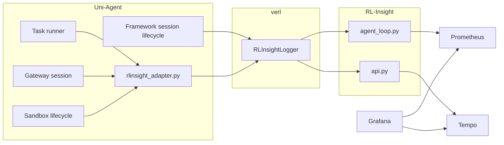
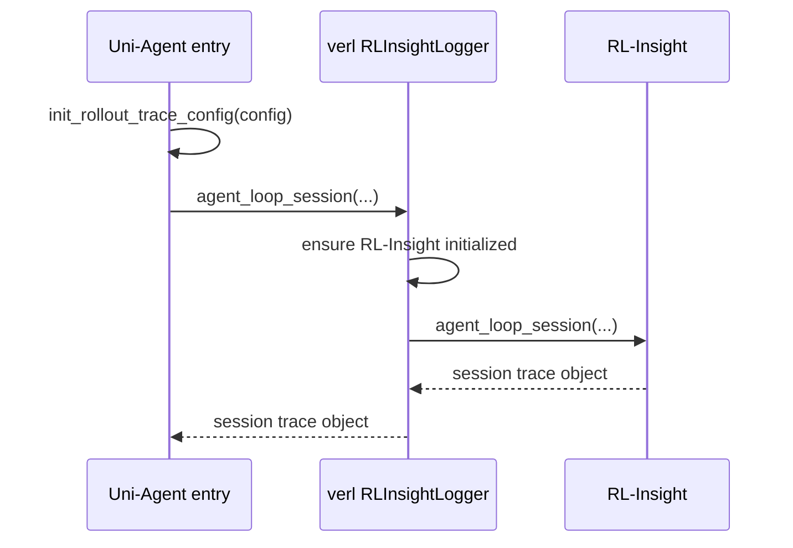
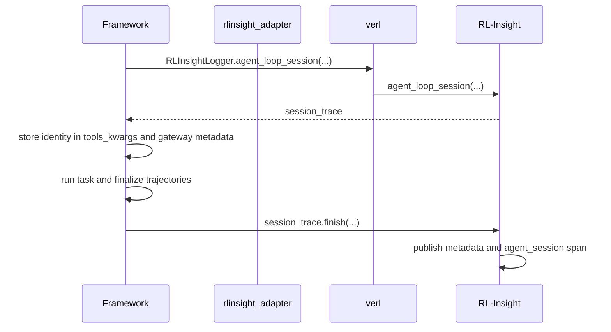
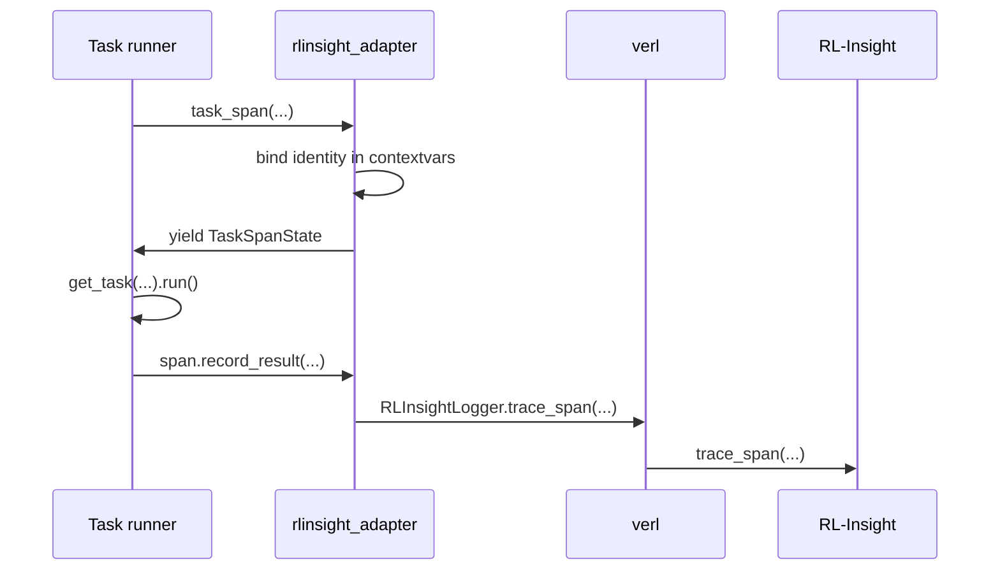
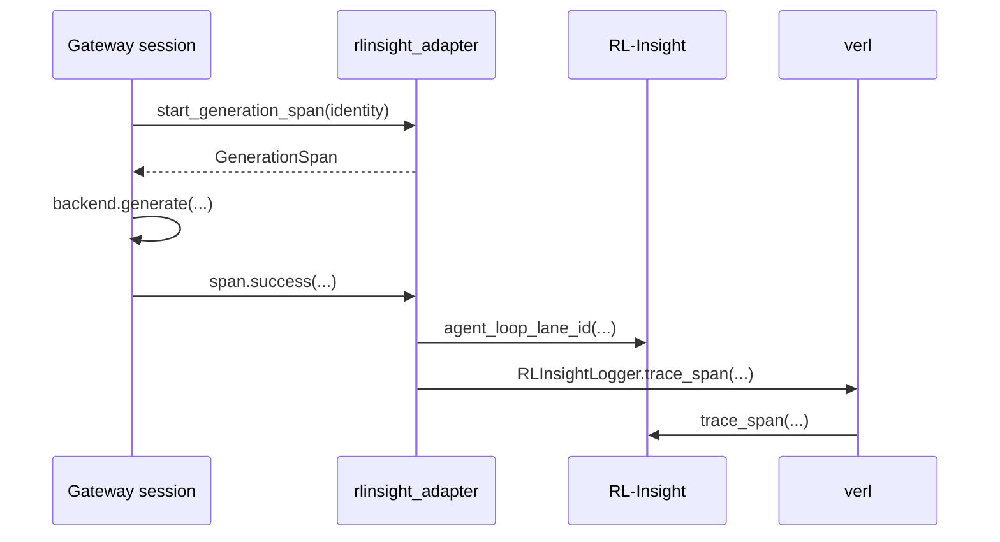
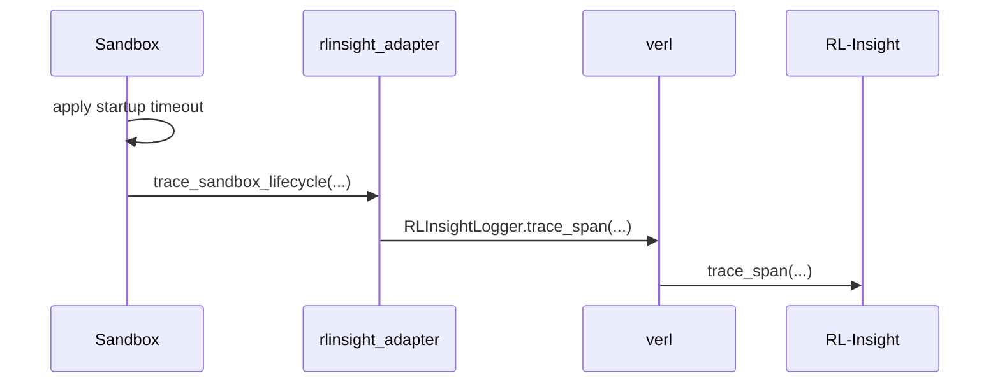
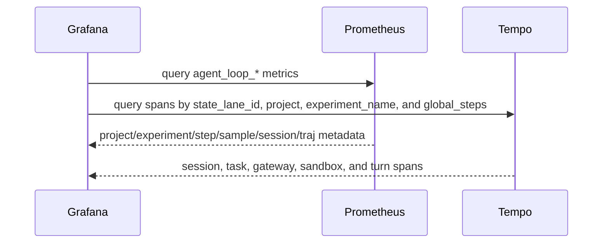

# RL-Insight Integration

This document explains how Uni-Agent, verl, and RL-Insight cooperate during
agent-loop training. It is the intended reference for the responsibilities,
public interfaces, data contracts, and runtime call sequence of the integration.

## Design goals

The integration follows three principles:

1. **RL-Insight owns the observability protocol.**
   It defines lane IDs, identity fields, dashboard metric names, and the
   session-level reporting API.

2. **verl is a thin trainer-side adapter.**
   It initializes RL-Insight from trainer configuration and forwards calls from
   Uni-Agent. It does not own agent-loop semantics.

3. **Uni-Agent owns business instrumentation.**
   It knows when a task starts, a model generation finishes, a sandbox starts or
   stops, and a session is complete. It maps those business events to RL-Insight
   APIs without reimplementing the observability protocol.

## Repository responsibilities

| Repository | Owns | Does not own |
| --- | --- | --- |
| RL-Insight | Observability protocol, lane ID format, session identity, span API, dashboard metadata, backend integration | Task, gateway, sandbox, or trainer business logic |
| verl | Trainer configuration, lazy RL-Insight initialization, thin forwarding between Uni-Agent and RL-Insight | Agent-loop protocol details or dashboard semantics |
| Uni-Agent | Task, gateway, sandbox, and session business instrumentation | Lane ID format, metric names, or dashboard data protocol |

## Architecture



Uni-Agent calls verl's `RLInsightLogger` for two reasons:

1. verl knows the trainer runtime and can lazily initialize RL-Insight.
2. verl can derive the default `experiment_name` from `RolloutTraceConfig`.

For lane IDs, Uni-Agent imports `agent_loop_lane_id` directly from RL-Insight.
That function is a pure protocol helper and does not require trainer-side
initialization.

## Public API surface

### RL-Insight

RL-Insight exposes one agent-loop-specific top-level API:

```python
from rl_insight import agent_loop_session
```

It also exposes generic observability APIs:

```python
from rl_insight import trace_span, metric_gauge
```

The agent-loop module additionally provides:

```python
from rl_insight.agent_loop import agent_loop_lane_id
```

`agent_loop_lane_id` is intentionally not exported from the package root. It is
an implementation detail needed by Uni-Agent's gateway instrumentation.

### verl

verl exposes two relevant methods on `RLInsightLogger`:

```python
RLInsightLogger.trace_span(...)
RLInsightLogger.agent_loop_session(...)
```

`trace_span` forwards to `rl_insight.api.trace_span`.
`agent_loop_session` forwards to `rl_insight.agent_loop.agent_loop_session`.

### Uni-Agent

Uni-Agent's adapter is implemented in:

```text
uni_agent/rlinsight_adapter.py
```

Its public interfaces are:

```python
init_rollout_trace_config(config)
task_span(tools_kwargs, task_name=..., prompt=...)
start_generation_span(identity)
trace_sandbox_lifecycle(operation, sandbox=..., lifecycle=...)
```

It also provides two public state classes:

```python
TaskSpanState
GenerationSpan
```

All module-internal helpers use a leading underscore.

## Core code map

### RL-Insight

| Code | Responsibility |
| --- | --- |
| `rl_insight/agent_loop.py` | Agent-loop protocol, identity, session API, dashboard metadata |
| `rl_insight/api.py` | Generic span and metric APIs |
| `rl_insight/config/services/grafana/dashboards/agent_loop_trajectory.json` | Grafana dashboard queries and panels |

Important functions:

```python
agent_loop_lane_id(experiment_name, sample, session, traj)
agent_loop_session(...)
trace_span(...)
metric_gauge(...)
```

### verl

| Code | Responsibility |
| --- | --- |
| `verl/utils/tracking.py` | Trainer-side adapter and lazy initialization |

Important methods:

```python
RLInsightLogger.trace_span(...)
RLInsightLogger.agent_loop_session(...)
RLInsightLogger._ensure_rl_insight_init()
```

### Uni-Agent

| Code | Responsibility |
| --- | --- |
| `uni_agent/rlinsight_adapter.py` | Uni-Agent instrumentation adapter |
| `uni_agent/framework/framework.py` | Session lifecycle and session span |
| `uni_agent/framework/task_runner.py` | Task execution and task span |
| `uni_agent/gateway/session/session.py` | Gateway generation span |
| `uni_agent/sandbox/base.py` | Sandbox lifecycle span and startup timeout |

## Data contract

### Identity fields

Every span carries a common identity:

```text
project
experiment_name
global_steps
sample
session
traj
state_lane_id
uid
global_steps
session_id
```

The canonical lane format is:

```text
experiment={experiment_name}/sample={sample}/session={session}/traj={traj}
```

For historical compatibility, some older spans may contain `sample_index` or
`session_index`. New code uses `sample` and `session` only.

### Span names

| Span | Source | Meaning |
| --- | --- | --- |
| `agent_session` | Framework | One complete gateway session |
| `agent_task` | Task runner | One task episode |
| `gateway_generation` | Gateway | One model generation turn |
| `agent_sandbox` | Sandbox | One sandbox start or stop |

### Dashboard metrics

RL-Insight publishes these gauge families:

```text
agent_loop_run_info
agent_loop_sample_info
agent_loop_session_info
agent_loop_traj_info
agent_loop_first_turn_unixtime
agent_loop_last_turn_unixtime
```

Grafana uses these metrics to enumerate runs, samples, sessions, and
trajectories. It uses Tempo to display turn-level spans.

## Runtime sequence

### 1. Trainer initialization



### 2. Session lifecycle



### 3. Task span



### 4. Gateway generation span



### 5. Sandbox lifecycle span



Sandbox startup timeout and retry policy remain in `sandbox/base.py`.
`trace_sandbox_lifecycle` only observes the operation.

### 6. Dashboard query



## Implementation details

### Session trace

`agent_loop_session` returns an immutable session trace object. It contains:

```python
{
    "identity": {...},
    "start_ns": ...
}
```

The framework stores the identity in:

```python
tools_kwargs["_trace_identity"]
gateway_metadata["_trace_identity"]
```

When the session finishes, the framework calls:

```python
session_trace.finish(...)
```

That call publishes both the dashboard metadata and the `agent_session` span.

### Task trace

`task_span` wraps the whole task episode. It:

1. Extracts the identity from `tools_kwargs`.
2. Binds the identity to `contextvars`.
3. Yields a `TaskSpanState`.
4. Records reward, accuracy, completion, and posting status.
5. Reports one `agent_task` span.

### Gateway trace

`GenerationSpan` tracks one model generation. It records:

```text
turn
type
tools
finish_reason
content
prompt_tokens
completion_tokens
chain_id
status
error
```

The gateway reports one span per generation turn.

### Sandbox trace

`trace_sandbox_lifecycle` observes start and stop operations. It records:

```text
provider
image
runtime_id
lifecycle
status
error
```

It does not own startup timeout or retry logic.

## Verification

The integration is covered by:

```text
rl-insight/tests/monitor/ut/test_agent_loop.py
rl-insight/tests/monitor/ut/test_api.py
verl/tests/utils/test_tracking_on_cpu.py
uni-agent/tests/uni_agent/test_rlinsight_adapter.py
uni-agent/tests/uni_agent/framework/test_generate_sequences_on_cpu.py
uni-agent/tests/uni_agent/gateway/test_session_multiple_chains_on_cpu.py
uni-agent/tests/uni_agent/sandbox/test_docker_sandbox.py
```

## Summary

```text
RL-Insight defines the protocol.
verl performs thin trainer-side forwarding.
Uni-Agent prepares business data and reports business events.
```
